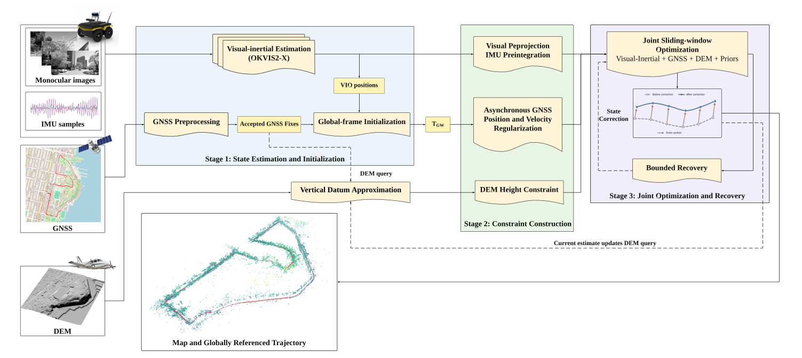

# DGVI-SLAM

**DEM-Aided Visual–Inertial SLAM with Bounded Position-Fix GNSS Recovery in Variable-Elevation Urban Environments**

DGVI-SLAM combines camera and IMU measurements, position-fix GNSS, and a georeferenced digital elevation model (DEM). It builds on [OKVIS2-X](https://github.com/ethz-mrl/OKVIS2-X), retaining its visual–inertial backend and asynchronous GNSS factors while adding persistent global initialization, bounded trajectory recovery, and terrain-height constraints.



*System overview from Fig. 2 of the accompanying manuscript. Accepted GNSS fixes initialize the global frame; GNSS and DEM constraints support sliding-window estimation, with bounded recovery when GNSS and VIO positions persistently disagree.*

## What the system does

- Screens GNSS fixes using receiver status, reported uncertainty, and horizontal speed.
- Initializes the global reference from persistent GNSS–VIO position correspondences.
- Combines asynchronous GNSS position factors with horizontal-velocity regularization.
- Queries DEM tiles at estimated global positions and adds height constraints after global alignment is fixed.
- Applies bounded translations to active poses and landmarks during sustained GNSS–VIO disagreement.

The manuscript evaluates five public and six field sequences. On the field sequences, adding DEM reduces the median SE(3)-aligned position RMSE from 6.17 to 4.32 m (30.0%), relative to offline LIO-SAM reference trajectories. These are manuscript results, not results regenerated by this repository cleanup.

## Build

The primary entry point is the **offline dataset application**, `dgvi_slam_app`. The default build disables ROS 2, RealSense, and neural depth/segmentation networks. Inherited mapping libraries remain dependencies of the backend.

Start from this repository and initialize its pinned submodules:

```bash
git clone --recurse-submodules https://github.com/yaxlee/Terrian-SLAM.git DGVI-SLAM
cd DGVI-SLAM
git submodule update --init --recursive
```

The repository URL above is its current location. The project and executable use the DGVI-SLAM name. Access to a private repository requires your normal GitHub authentication; the `supereight2` submodule currently uses an SSH URL.

On Ubuntu 22.04, the native dependencies are:

```bash
sudo apt update
sudo apt install build-essential cmake git libgoogle-glog-dev libgflags-dev \
  libatlas-base-dev libeigen3-dev libsuitesparse-dev \
  libboost-dev libboost-filesystem-dev libopencv-dev \
  libgeographic-dev libgdal-dev libpcl-dev
```

Use a CMake version compatible with the pinned Ceres submodule. The project uses C++17. The upstream build instructions use `libgeographiclib-dev` instead of `libgeographic-dev` on Ubuntu 24.04.

```bash
cmake -S . -B build -DCMAKE_BUILD_TYPE=Release \
  -DBUILD_ROS2=OFF -DHAVE_LIBREALSENSE=OFF \
  -DUSE_NN=OFF -DUSE_GPU=OFF -DBUILD_LEGACY_APPS=OFF
cmake --build build --target dgvi_slam_app -j4
```

`resources/small_voc.yml.gz` is required for place recognition and is copied beside the executable during the build. Keep the tracked runtime resources and pinned submodules. ROS 2 and the inherited dense-mapping applications are optional integrations; their interfaces do not replace the DEM-enabled offline workflow documented here.

## Prepare input data

Use the converted dataset layout expected by `DatasetReader`:

| Path | Contents |
|---|---|
| `cam0/data.csv` | Header, then `timestamp_ns,filename` |
| `cam0/data/` | Images referenced by the camera CSV |
| `imu0/data.csv` | Header, then `timestamp_ns,wx,wy,wz,ax,ay,az` |
| `gps0/data_raw.csv` | Geodetic GNSS records described below |

Add `cam1`, etc. when a calibrated profile contains multiple cameras. Image filenames are relative to the camera's `data/` directory. Angular velocity is in rad/s, acceleration in m/s². Camera, IMU, and GNSS timestamps must use a consistent clock and epoch; the current reader applies no GNSS leap-second offset.

For `gps_parameters.data_type: geodetic`, each GNSS row starts with:

```text
timestamp_ns,latitude_deg,longitude_deg,altitude_m,horizontal_error_m,vertical_error_m
```

An optional extended row contains `vx,vy,vz,vel_dt,cov_type,fix_status` after those six fields. The current reader extracts `fix_status` from column 12; it derives velocity constraints from position fixes rather than consuming the velocity columns. Error fields represent standard deviations, not variances. The exported status convention must match `min_fix_status`; do not copy a different receiver's status codes without checking their meaning.

DEM rasters are supplied separately as GeoTIFF (`.tif`/`.tiff`) or GDAL VRT files. Rasters must contain usable georeferencing and cover the route. Multiple rasters are queried in command-line order, using the first valid height. GNSS altitude, DEM height, sensor height, and the selected geoid model must follow a consistent vertical convention. See [configuration guidance](config/README.md).

## Run

Choose a profile and verify its calibration and acquisition settings:

| Profile | Purpose |
|---|---|
| [Field](config/field/dgvi_slam.yaml) | Existing field-system calibration and DEM-enabled settings |
| [FusionPortableV2 + DEM](config/fusionportable/dgvi_slam.yaml) | Existing FusionPortable profile with DEM |
| [FusionPortableV2 GNSS](config/fusionportable/gnss_only.yaml) | Existing GNSS-only profile |
| [UrbanLoco](config/urbanloco/dgvi_slam.yaml) | Existing UrbanLoco profile with DEM enabled |

These are the configurations present in the source snapshot, not a complete per-sequence parameter archive. In particular, the two FusionPortable profiles also differ in the image mask and optimization-window sizes. For a controlled DEM ablation, copy one profile and change only `dem_parameters.use`, retaining the same input data and all other settings.

```bash
# Camera + IMU + GNSS + one or more DEM tiles
./build/dgvi_slam_app config/field/dgvi_slam.yaml \
  /path/to/sequence results/field /path/to/dem.tif

# GNSS-only profile
./build/dgvi_slam_app config/fusionportable/gnss_only.yaml \
  /path/to/sequence results/fusionportable

# Record configuration, command, exit code, and log in a unique run directory
./scripts/run_and_log.sh config/field/dgvi_slam.yaml \
  /path/to/sequence results/field /path/to/tile1.tif /path/to/tile2.tif
```

The application accepts `CONFIG DATASET [OUTPUT_DIR] [DEM ...] [-rpg]`; the default output directory is `results` in the current working directory. The inherited `-rpg` reader is not a DEM workflow. A DEM-enabled profile requires geodetic GNSS and at least one readable DEM raster. Setting `dem_parameters.use: false` disables DEM loading, GNSS height replacement/blending, and DEM factors.

The wrapper accepts `CONFIG DATASET [OUTPUT_DIR] [DEM ...]`. Supply `OUTPUT_DIR` explicitly when passing DEM paths. For a nonstandard build directory, set `DGVI_SLAM_EXECUTABLE` to the executable's absolute path.

## Outputs and evaluation

For SLAM mode, output filenames start with `dgvi-slam-slam`; disabling loop closure changes the mode to `vio`.

| Suffix | Contents |
|---|---|
| `_trajectory.csv` | Streamed optimized states in the local world frame |
| `-final_trajectory.csv` | Final local trajectory |
| `-global-final_trajectory.csv` | Global-frame trajectory when GNSS is configured and global output is available |
| `-final-ba_trajectory.csv` | Export after the optional final-BA stage; the filename can be written even when BA is disabled |
| `-global-final-ba_trajectory.csv` | Corresponding global export |
| `-final_map.csv` | Landmark map when final BA and map saving are enabled |

Trajectory CSVs begin with `timestamp_ns,px,py,pz,qx,qy,qz,qw` and may contain additional state columns. Convert the first eight columns to TUM format with:

```bash
python3 tools/convert_to_tum.py results/field/dgvi-slam-slam-final_trajectory.csv
```

The converter preserves nanosecond timestamp precision, uses only the Python standard library, and refuses to overwrite an existing output. Use `-o` to select another filename.

The paper uses independent INS ground truth for FusionPortableV2, GNSS-fix consistency for UrbanLoco, and offline LiDAR–inertial reference trajectories for the field sequences. Keep these reference types distinct when reporting results. Dataset recordings, DEM tiles, and evaluation outputs are not bundled here.

## Code map

| Location | Responsibility |
|---|---|
| `okvis_apps/src/dgvi_slam_app.cpp` | Offline application, sensor callbacks, DEM setup, trajectory output |
| `okvis_multisensor_processing/src/DatasetReader.cpp` | Input parsing, GNSS screening, geoid handling, raster queries |
| `okvis_ceres/src/ViGraph.cpp` | GNSS factors, global initialization, bounded recovery |
| `okvis_ceres/src/ViSlamBackend.cpp` | Backend coordination, height blending, DEM-factor refresh |
| `okvis_ceres/src/DemHeightError.cpp` | DEM height residual and Jacobians |
| `okvis_common/src/ViParametersReader.cpp` | Configuration parser |
| `config/` | Dataset profiles and parameter guidance |

The `okvis` C++ namespace, library targets, source directories, and upstream copyright notices are retained to preserve provenance and library compatibility. The CMake project and ROS package are named `dgvi_slam`. Inherited ROS node executable names and topic namespaces remain unchanged.
